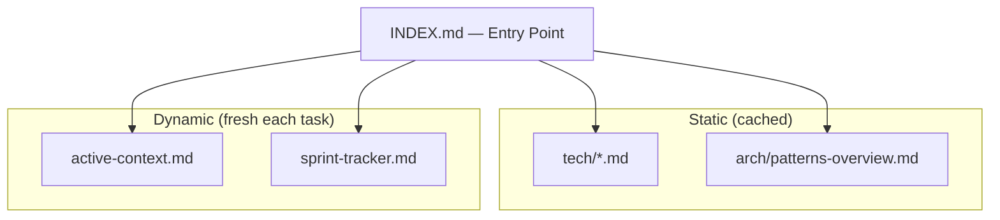
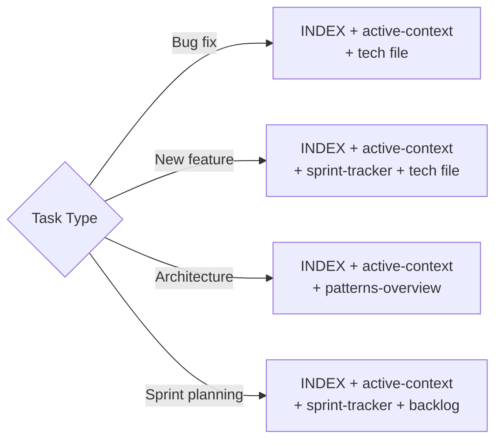
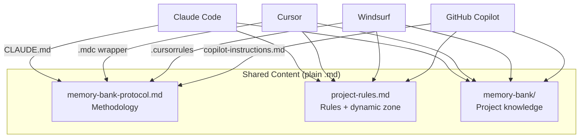

# Context-Optimized Memory Bank (COMB)

A methodology for **significant token reduction** in AI-assisted software development through intelligent documentation structure and context-aware reading strategies.

<p align="center">
  
</p>

---

## The Problem

When using AI assistants (Claude, Cursor, GitHub Copilot, etc.) on long-running software projects, context window limitations become a critical bottleneck:

- **Token exhaustion**: Large codebases + full documentation = context limit hit on every session
- **Repeated context loading**: Every new session re-reads the same static information
- **Stale context**: AI loses track of current sprint, decisions, and active work
- **Cost escalation**: Every loaded token costs compute — bloated context = high cost

## The Solution: COMB

**Context-Optimized Memory Bank (COMB)** is a structured documentation methodology that:

1. **Separates static from dynamic knowledge** — Architecture docs read once, sprint status read fresh
2. **Implements cache-aware reading order** — Static files load first to maximize LLM cache hit rates
3. **Uses hierarchical context loading** — AI reads only what the current task requires
4. **Automates memory updates** — Completion signals trigger targeted document updates
5. **Archives historical data** — Completed sprints move to archives, keeping active files lean

## How It Works



Instead of loading all documentation every session, COMB:

- **Separates static from dynamic** — Architecture docs cached, sprint status read fresh
- **Routes by task type** — Bug fix loads different files than sprint planning
- **Optimizes reading order** — Static files first to maximize LLM prompt cache hits
- **Keeps files lean** — Active files stay small, historical data moves to archives



## Quick Start

### 1. Create the project structure

```
your-project/
├── memory-bank-protocol.md     ← methodology (plain markdown, shared by all tools)
├── project-rules.md            ← project rules + dynamic zone (plain markdown, shared)
├── CLAUDE.md                   ← Claude Code pointer (~40 lines)
├── .cursorrules                ← Windsurf / non-MDC alternative (optional)
├── .gitignore                  ← git ignore rules
├── .cursorignore               ← files Cursor should skip (saves tokens)
├── .claudeignore               ← files Claude should skip (saves tokens)
├── .cursor/
│   └── rules/
│       └── memory-bank.mdc     ← Cursor wrapper (thin .mdc, auto-applies the above files)
└── memory-bank/
    ├── INDEX.md
    ├── core/
    ├── tech/
    └── arch/
```

### 2. Copy the memory bank templates

Copy the [templates/memory-bank/](templates/memory-bank/) folder into your project root. The folder structure mirrors the target layout exactly:

| Template | Destination | Purpose |
|----------|------------|---------|
| [memory-bank/INDEX.md](templates/memory-bank/INDEX.md) | `memory-bank/INDEX.md` | Master navigation hub |
| [memory-bank/core/active-context.md](templates/memory-bank/core/active-context.md) | `memory-bank/core/active-context.md` | Current work focus |
| [memory-bank/core/sprint-tracker.md](templates/memory-bank/core/sprint-tracker.md) | `memory-bank/core/sprint-tracker.md` | Sprint status and planning |
| [memory-bank/tech/tech-stack.md](templates/memory-bank/tech/tech-stack.md) | `memory-bank/tech/[domain]-stack.md` | Technology stack per domain |
| [memory-bank/arch/patterns-overview.md](templates/memory-bank/arch/patterns-overview.md) | `memory-bank/arch/patterns-overview.md` | Architecture patterns |

### 3. Configure your AI assistant

Copy these files to your project root (and `.cursor/rules/` for Cursor):

| Template | Destination | Purpose |
|----------|------------|---------|
| [memory-bank-protocol.md](templates/memory-bank-protocol.md) | project root | Shared methodology (all AI tools) |
| [project-rules.md](templates/project-rules.md) | project root | Shared rules + dynamic zone (all AI tools) |
| [CLAUDE.md](templates/CLAUDE.md) | project root | Claude Code pointer |
| [memory-bank.mdc](templates/cursor/memory-bank.mdc) | `.cursor/rules/` | Cursor thin wrapper |
| [.cursorrules](templates/.cursorrules) | project root | Windsurf / non-MDC alternative |
| [.gitignore](templates/.gitignore) | project root | Git ignore rules |
| [.cursorignore](templates/.cursorignore) | project root | Files Cursor should skip |
| [.claudeignore](templates/.claudeignore) | project root | Files Claude should skip |

### 4. Set up skills and automation (optional)

COMB includes ready-to-use skills for creating and updating the memory bank:

**Claude Code** — copy to `.claude/skills/`:

| Skill | Trigger | Purpose |
|-------|---------|---------|
| [create-memory-bank](templates/skills/claude/create-memory-bank/SKILL.md) | `/create-memory-bank [name]` | New project (greenfield) |
| [adopt-memory-bank](templates/skills/claude/adopt-memory-bank/SKILL.md) | `/adopt-memory-bank [name]` | Existing project (brownfield) |
| [update-memory-bank](templates/skills/claude/update-memory-bank/SKILL.md) | `/update-memory-bank` or auto | Update after task completion |
| [hooks](templates/skills/claude/hooks/) | Automatic (post git commit) | Suggest memory bank update after commits |

**Cursor** — copy to `.cursor/rules/`:

| Rule | Trigger | Purpose |
|------|---------|---------|
| [create-memory-bank.mdc](templates/skills/cursor/create-memory-bank.mdc) | "create memory bank" | New project (greenfield) |
| [adopt-memory-bank.mdc](templates/skills/cursor/adopt-memory-bank.mdc) | "adopt memory bank" | Existing project (brownfield) |
| [update-memory-bank.mdc](templates/skills/cursor/update-memory-bank.mdc) | Auto (always active) | Update after task completion |

### 5. Apply the reading strategy

The INDEX.md contains a decision tree:

- **Bug fix** → INDEX + active-context + relevant tech file (~800 lines)
- **New feature** → INDEX + active-context + sprint-tracker + tech file (~1,050 lines)
- **Architecture change** → INDEX + active-context + patterns-overview (~1,000 lines)
- **Sprint planning** → INDEX + active-context + sprint-tracker + backlog (~1,050 lines)

## Repository Structure

```
github/
├── README.md                                ← This file
├── docs/
│   ├── 01-memory-bank-overview.md          ← What COMB is and why it works
│   ├── 02-file-structure.md                ← How to organize files and categories
│   ├── 03-reading-strategy.md              ← Smart reading patterns (cache-aware, task-based)
│   ├── 04-update-protocol.md               ← How and when to update memory bank files
│   └── 05-metrics-and-tuning.md            ← How to measure and improve performance
├── LICENSE                                  ← MIT License
└── templates/
    ├── memory-bank-protocol.md             ← Protocol: methodology, workflows → project root
    ├── project-rules.md                    ← Rules + dynamic zone → project root
    ├── CLAUDE.md                           ← Claude Code pointer → project root
    ├── .cursorrules                        ← Windsurf / non-MDC alternative → project root
    ├── .gitignore                          ← Git ignore rules → project root
    ├── .cursorignore                       ← Cursor AI ignore rules → project root
    ├── .claudeignore                       ← Claude Code ignore rules → project root
    ├── cursor/
    │   └── memory-bank.mdc                ← Cursor wrapper → .cursor/rules/
    ├── skills/                             ← Skills and automation
    │   ├── claude/
    │   │   ├── create-memory-bank/SKILL.md ← /create-memory-bank (greenfield)
    │   │   ├── adopt-memory-bank/SKILL.md  ← /adopt-memory-bank (brownfield)
    │   │   ├── update-memory-bank/SKILL.md ← /update-memory-bank (auto/manual)
    │   │   └── hooks/                      ← Hook config + post-commit script
    │   └── cursor/
    │       ├── create-memory-bank.mdc      ← Cursor create rule (greenfield)
    │       ├── adopt-memory-bank.mdc       ← Cursor adopt rule (brownfield)
    │       └── update-memory-bank.mdc      ← Cursor auto-update rule
    └── memory-bank/                        ← Memory bank templates → memory-bank/
        ├── INDEX.md                        ← Master navigation hub
        ├── core/
        │   ├── active-context.md           ← Current work focus
        │   └── sprint-tracker.md           ← Sprint status and planning
        ├── tech/
        │   └── tech-stack.md              ← Technology stack documentation
        └── arch/
            └── patterns-overview.md    ← Architecture patterns
```

## Core Concepts

| Concept | Description |
|---------|-------------|
| **INDEX.md** | Single entry point; routes AI to correct files per task type |
| **Active Context** | Dynamic file: current sprint focus, blockers, next steps |
| **Tech Stack files** | Semi-static: tech choices per layer (backend, frontend, infra) |
| **Architecture files** | Static: ADRs, patterns — cache these for entire sessions |
| **Sprint Tracker** | Dynamic: current sprint tasks, hours, completion status |
| **Archive files** | Historical data moved out of active files to reduce size |

## Multi-Tool Architecture

All shared content lives in **plain markdown**. Only the Cursor wrapper uses `.mdc`:



**Design principle**: `.mdc` is Cursor-specific — never referenced by Claude. All shared content is plain `.md`.

## Compatibility

| Tool | Reads | How |
|------|-------|-----|
| **Claude Code** | `CLAUDE.md` → `memory-bank-protocol.md` + `project-rules.md` | All plain markdown |
| **Cursor** | `.mdc` wrapper → `memory-bank-protocol.md` + `project-rules.md` | `.mdc` auto-applies, content is plain markdown |
| **Windsurf** | `.cursorrules` | Copy shared `.md` content into `.cursorrules` |
| **GitHub Copilot** | `.github/copilot-instructions.md` | Copy shared `.md` content into instructions |
| **Any AI tool** | Direct file read | Point AI at `memory-bank-protocol.md` + `project-rules.md` |

## License

[MIT License](LICENSE) — free to use, modify, and distribute.

---

> **Origin**: This methodology was developed and battle-tested on a multi-sprint enterprise software project, then generalized here for use on any software project.
